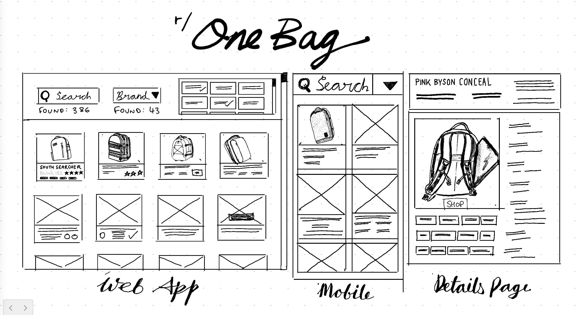

# Nuxt Bags Project

My js-fu🥷 project to try out Nuxt, SSR and SPA deployment.

This project is intended to have a backend (eventually), but should be able to be deployed as a static site initially.



## Data
Data from r/onebag subreddit -  [r/onebag](https://www.reddit.com/r/onebag/comments/xcgeoh/updated_onebagzill_bag_comparison_spreadsheet/)
Converted to JSON using google sheets api [data/products.json](data/products.json) and is served via api <http://localhost:3000/api/products>

Look at the [Nuxt 3 documentation](https://nuxt.com/docs/getting-started/introduction) to learn more.

## TODO:
- ~~Retrieve Spreadsheet data via Google Docs API~~
- ~~Store the data in a Pinia store~~
- ~~Regroup and display the data as a grid of images~~
- ~~Display fallback images~~
- ~~Use a virtual scroller to replace existing DOM elements as the user scrolls~~
- ~~Integrate Bulma and create Nuxt layouts~~
- ~~Utilise Nuxt content and pages~~
- ~~Create favicon and share links~~
- ~~Integrate IonIcons~~
- ~~Implement a detail page for each product~~
- ~~Add brand dropdown~~
- ~~Add laptop size dropdown~~
- ~~Add toggle filtering for any applicable spreadsheet columns~~
- ~~Add text search~~
- Develop a Single Page Application with offline support
- Add backend database in Firebase
- Add Webauthn authentication
- Add favouriting feature
- Add commenting feature
- Add editable content page for products
- Model the store data with Pinia-ORM
- Deploy using Railway or Vercel
- Improve Server Side Rendering performance
- Create Apache Cordova mobile app

## Setup

```bash
bun install
```
> https://bun.sh/

## Development Server

Start the development server on <http://localhost:3000>

```bash
bun run dev
```

Check out the [deployment documentation](https://nuxt.com/docs/getting-started/deployment) for more information.


## Deployment

I intend to deploy this app using the Nuxt deployment documentation <https://nuxt.com/deploy>

will probably go with vercel initially.
